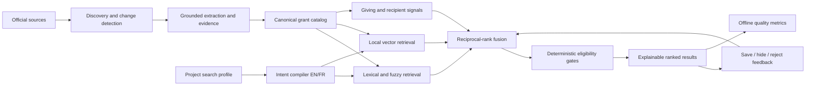

# IialGrants Grant Search Modernization Plan

Status: **approved implementation plan — execution in progress**
Owner: Codex (grant opportunity retrieval); Claude owns the separate funder-search slice documented in `docs/HANDOFF-CODEX.md`.
Last updated: 2026-07-21
Target: local-first, bilingual Canadian grant search with measurable relevance and complete decision provenance.

## 1. Outcome

Build a search system that can answer, reproducibly:

1. Which active Canadian opportunities match this specific project?
2. Which hard eligibility rules allow or block the applicant?
3. Why is result A ranked above result B?
4. Which relevant opportunities were probably missed?
5. How fresh and trustworthy is each field and deadline?
6. Did user feedback improve later recommendations?

The system is complete only when the quality gates in section 12 pass. “The UI
looks plausible” is not an acceptance criterion.

## 2. Current baseline (2026-07-21)

- 5 active funders, 23 active grants after non-grant cleanup.
- 2 persisted fit evaluations and 4 knowledge chunks in the local database.
- Catalog retrieval uses PostgreSQL full-text search plus trigram similarity in
  `search_grant_catalog`.
- Results can be filtered by jurisdiction, evaluated eligibility, and deadline;
  sorted by relevance, fit, deadline, amount, or discovery time.
- Deterministic F1/F3/F4/F5 checks, raw LLM score, combined score, and exact
  decision snapshot are persisted and browser-visible.
- Discovery is first-party-first with crawl attempt telemetry and honest
  degraded/failed states.

### Main gaps

1. Corpus coverage is too small to support industry-grade recall.
2. Search intent is organization-wide, not project-specific.
3. Embeddings exist for RAG but do not participate in catalog retrieval.
4. Save/hide/reject decisions do not train or personalize ranking.
5. T3010 and recipient intelligence are not ranking features.
6. Deadline confidence and predicted recurrence are not first-class fields.
7. There is no retrieval golden set or Recall@K/nDCG quality gate.
8. Facets do not cover applicant type, population served, funding use, funder
   type, evidence confidence, or deadline confidence.

## 3. Target architecture



Rules remain authoritative for hard eligibility. Semantic similarity may improve
recall and ordering but must never override a hard fail.

## 4. Data model

### 4.1 `grant_search_profiles`

One organization may have multiple project intents.

| Column                          | Type             | Contract                                              |
| ------------------------------- | ---------------- | ----------------------------------------------------- |
| `id`                            | uuid PK          | Stable profile identifier                             |
| `user_id`                       | uuid FK          | Owner; RLS self/admin                                 |
| `org_id`                        | uuid nullable FK | Tenant boundary                                       |
| `name`                          | text             | Human-readable project name                           |
| `mission`                       | text             | Project-specific intent, not organization boilerplate |
| `activities`                    | text[]           | Concrete funded activities                            |
| `populations_served`            | text[]           | Controlled bilingual taxonomy                         |
| `funding_uses`                  | text[]           | Research, equipment, wages, training, etc.            |
| `sectors`                       | text[]           | Normalized controlled taxonomy                        |
| `jurisdictions`                 | text[]           | ISO country/province codes                            |
| `applicant_types`               | text[]           | nonprofit, charity, municipality, etc.                |
| `amount_min_cad/max_cad`        | numeric nullable | Requested range                                       |
| `project_start/end`             | date nullable    | Runway and recurrence context                         |
| `role`                          | enum             | lead, partner, either                                 |
| `required_terms/excluded_terms` | text[]           | Explicit user controls                                |
| `active`                        | boolean          | Only active profiles receive matches                  |
| timestamps                      | timestamptz      | Audit and freshness                                   |

### 4.2 `grant_search_feedback`

Append-only user relevance judgments.

- Key: `(profile_id, grant_id, user_id)` with latest materialized state or an
  append-only event table plus current-state view.
- Actions: `saved`, `hidden`, `rejected`, `restored`, `pursued`.
- Rejection reasons: applicant type, jurisdiction, sector, population, funding
  use, amount, deadline, capacity, duplicate, not a grant, other.
- Optional note, query text, rank position, score snapshot, and timestamp.
- Feedback is project-scoped; hiding a grant for one project does not globally
  archive it.

### 4.3 Grant search fields

Add normalized, evidence-backed fields only when extraction supports them:

- `applicant_types text[]`
- `populations_served text[]`
- `funding_uses text[]`
- `funder_type text`
- `deadline_kind`: confirmed, predicted, rolling, closed, unknown
- `deadline_confidence numeric`
- `next_expected_open/deadline date`
- `search_document text`
- `search_embedding vector`
- `embedding_model`, `embedding_updated_at`
- `source_freshness_at`, `source_confidence`

Every extracted field must retain evidence in `evidence_spans`; unknown stays
unknown and never becomes a fabricated negative.

### 4.4 Search telemetry

`grant_search_runs` records profile/query, candidate counts by retrieval path,
latency, fusion weights, index/model versions, and result IDs/scores. Never
store hidden model reasoning.

## 5. Retrieval contract

### Stage A — intent compilation

Normalize EN/FR terms, jurisdiction aliases, sectors, populations, funding uses,
and explicit exclusions. Generate deterministic query variants; do not depend on
an LLM for the minimum viable query.

### Stage B — candidate generation

Run independently:

1. PostgreSQL weighted FTS over title, summary, funder, sectors, eligibility,
   populations and funding use.
2. Trigram retrieval for names, acronyms and typos.
3. pgvector cosine retrieval using local `nomic-embed-text`.
4. Optional giving/peer candidates from T3010 and recipient history.

Provider failure must be visible. An unavailable vector model degrades to
lexical retrieval; it must not return a fake empty catalog.

### Stage C — fusion and policy

- Fuse candidate lists with Reciprocal Rank Fusion (RRF).
- Apply deterministic hard gates after candidate generation.
- Apply bounded boosts for fit, source confidence, freshness, confirmed
  deadline, prior peer giving, and positive profile feedback.
- Apply bounded penalties for hidden/rejected results, incomplete evidence,
  predicted deadlines, and stale sources.
- Persist component scores and the exact ranking version.

Initial score display:

```text
retrieval_score = RRF(lexical_rank, vector_rank, fuzzy_rank)
quality_score   = evidence + freshness + deadline_confidence
history_score   = peer_giving + repeat_funder + feedback
final_score     = retrieval + bounded quality/history boosts
eligible        = no deterministic hard fail
```

The UI must display component contributions, not a single unexplained number.

## 6. Coverage and freshness program

### Source tiers

- Tier A: federal/provincial official APIs, CKAN and program registries.
- Tier B: official funder program directories and sitemaps.
- Tier C: official RSS/news/open-call pages.
- Tier D: archives and third-party search used only as corroboration/seeding.

### Required source telemetry

- Last attempted/succeeded/changed timestamp.
- HTTP/acquisition status and fetch engine.
- Programs found, inserted, seen again, rejected as non-grant.
- Content hash and meaningful-change classification.
- Expected refresh interval and overdue flag.
- Owner and recovery instructions.

Coverage is reported by province, funder type, sector and source tier. Raw grant
count is never used as the sole coverage measure.

## 7. Deadline intelligence

1. Persist confirmed deadlines only from grounded official evidence.
2. Detect rolling/continuous intake explicitly.
3. Preserve closed cycles for recurrence analysis.
4. Predict a next cycle only from at least two historical observations or an
   explicit funder cadence; label it predicted with confidence.
5. Alert on material date changes and retain before/after evidence.
6. Filters must distinguish confirmed, predicted, rolling and unknown.

## 8. Giving and peer intelligence

- Link funders to T3010 identity and official program entities.
- Normalize recipients and organization aliases.
- Derive median/percentile award sizes, geographic concentration, sector mix,
  repeat-recipient rate, recency and trend.
- Let users select or suggest peer organizations.
- Expose “funded similar organizations” as a bounded ranking feature and an
  inspectable explanation.
- Historical giving never proves current eligibility and cannot bypass rules.

## 9. API and UI work

### Server APIs

- CRUD search profiles.
- Execute hybrid search with query/profile/facets/pagination.
- Save/hide/reject/restore feedback.
- List facet counts from the complete candidate set.
- Explain one result’s retrieval, rule, evidence and history components.
- Run/administer offline benchmark suites.

### Grant radar

- Project/profile selector.
- Search query plus advanced facet drawer.
- Visible active filter chips and “clear all”.
- Result reason: matched concepts, eligibility, evidence quality and deadline
  confidence.
- Save/hide/not-relevant controls with reason capture.
- “New since last review” and “changed since saved”.
- Separate active opportunities from long-term funder prospects.
- Empty states distinguish no match, provider degradation and restrictive
  filters.

### Manual/admin

- User manual workflow with screenshots/diagrams.
- Admin search-quality dashboard.
- Source coverage/freshness dashboard.
- Runbook for rebuilding embeddings and indexes on another machine.

## 10. Implementation sequence

### Phase 0 — benchmark first

Files: `src/evals/search/*`, fixtures, test runner, admin/report function.

- Define 25–50 bilingual queries tied to one or more profiles.
- Label relevant grants and graded relevance (0–3).
- Include typo, acronym, French/English, hard-fail and no-result cases.
- Compute Precision@K, Recall@K, MRR, nDCG@K and false-positive rate.
- Store baseline output in a reviewable JSON artifact.

Exit: deterministic benchmark runs locally and CI fails on agreed regression.

### Phase 1 — project profiles and feedback

- Migrations, RLS, generated Supabase types and server functions.
- Profile CRUD UI and profile selector.
- Save/hide/reject controls and audit events.
- Ranking consumes feedback only as bounded features.

Exit: two projects for the same organization produce distinct result ordering;
feedback is tenant-safe and reversible.

### Phase 2 — hybrid bilingual retrieval

- Build canonical search documents.
- Backfill local embeddings with resumable checkpoints.
- Add vector index and hybrid RPC/server orchestration.
- Add taxonomy/synonym versioning and RRF.
- Preserve lexical-only fallback.

Exit: benchmark improves without exceeding false-positive guardrail; Ollama-down
test proves graceful lexical fallback.

### Phase 3 — faceted evidence model

- Add applicant/population/use/funder/deadline fields.
- Extend grounded extraction and evidence links.
- Facet counts, filters and result explanations.

Exit: each facet has positive, unknown and conflicting-evidence tests.

### Phase 4 — giving and deadline intelligence

- Recipient normalization and peer selection.
- T3010 aggregate features and explanations.
- Deadline history, recurrence prediction and alerts.

Exit: historical signals improve ordering but cannot override a hard fail;
predicted dates are never displayed as confirmed.

### Phase 5 — coverage operations

- Expand official Canadian source registry.
- Source health/freshness SLAs and recovery playbooks.
- Scheduled discovery and change alerts.

Exit: coverage dashboard exposes gaps and every source has an accountable state.

## 11. File ownership map

| Area                    | Primary files                                                                                                         |
| ----------------------- | --------------------------------------------------------------------------------------------------------------------- |
| Current grant retrieval | `src/lib/grants.functions.ts`, migration `20260721193000...`                                                          |
| Search benchmark        | `src/evals/search/*`                                                                                                  |
| Profiles/feedback       | new `src/lib/grant-search-profiles.functions.ts`, migrations, radar components                                        |
| Hybrid retrieval        | new `src/lib/grant-search-hybrid.server.ts`; do not modify Claude-owned `search-hybrid.server.ts` until claim release |
| Embeddings              | `src/agents/embeddings.server.ts`, resumable backfill script                                                          |
| Discovery/coverage      | discoverer, curator, crawl ledger and admin source views                                                              |
| Rules                   | `src/agents/fit-rules*`                                                                                               |
| Giving intelligence     | `src/lib/giving-history.functions.ts`, recipient profiling                                                            |
| User documentation      | `src/routes/_authenticated.manual.tsx`, this document                                                                 |

Before editing, read `docs/HANDOFF-CODEX.md`; active claims override this map.

## 12. Quality gates and definition of done

### Automated

- TypeScript, ESLint, Prettier and production build pass.
- Full Vitest suite passes.
- RLS tests prove cross-tenant profile/feedback isolation.
- Migration security tests pass.
- Search benchmark thresholds:
  - Recall@20 >= 0.90 on the maintained corpus.
  - Precision@10 >= 0.75.
  - nDCG@10 >= 0.80.
  - Hard-fail leakage into “eligible” results = 0.
  - Non-grant false-positive rate <= 2%.
- Lexical fallback passes with Ollama unavailable.

Thresholds are initial targets and may be tightened only with a versioned
benchmark review; never lower them solely to make CI green.

### Real validation

- One bilingual positive search finds and explains the expected official grant.
- One typo/acronym search returns the intended program.
- One hard-ineligible grant is visible only when requested and clearly blocked.
- One provider/source failure is shown as degraded, not “no grants”.
- Save/hide changes only the selected project and can be reversed.
- Browser console contains no application errors.

### Operational

- Migration and embedding rebuild instructions work from a clean machine.
- No cloud LLM calls; all embeddings/inference stay local.
- Every score is reconstructable from persisted inputs/version metadata.
- Manual and DR documentation match the shipped UI.

## 13. Rollout and rollback

1. Ship additive tables and dual-read capability.
2. Backfill search documents and embeddings in resumable batches.
3. Run lexical and hybrid ranking in shadow mode; compare benchmark and live
   telemetry without changing user order.
4. Enable hybrid ranking behind a DB-configurable feature flag.
5. Roll out to admins, then all users.
6. Rollback toggles to lexical retrieval; never delete profiles, feedback or
   score snapshots.

Database migrations must be forward-fixable. Do not rewrite published Lovable
history or squash pushed commits.

## 14. Disaster recovery / migration to another machine

1. Clone the repository and checkout the documented commit.
2. Install Bun, Docker, Supabase CLI and Ollama versions from the developer
   guide.
3. Start local Supabase and apply all migrations.
4. Restore database/storage backup if migrating existing data.
5. Pull the configured local models, including `nomic-embed-text`.
6. Run the resumable search-document and embedding backfill.
7. Run typecheck, full tests, benchmark and production build.
8. Start the app, execute positive/blocked browser checks, and compare source
   health counts with the pre-migration report.

No backup is considered valid until restore and benchmark verification succeed.

## 15. Programmer handoff checklist

- [ ] Read `AGENTS.md`, this plan, and the latest handoff.
- [ ] Confirm no overlapping active claim.
- [ ] State the phase and exact files claimed.
- [ ] Add migration, RLS, generated types and tests together.
- [ ] Never fabricate unknown evidence or collapse provider failure to empty.
- [ ] Run focused tests, typecheck, full suite, lint and build.
- [ ] Perform one positive and one blocked/degraded real validation.
- [ ] Update this plan’s status and handoff with commands and evidence.
- [ ] Stage only owned files; preserve untracked user documents.
- [ ] Commit without rewriting published history.
